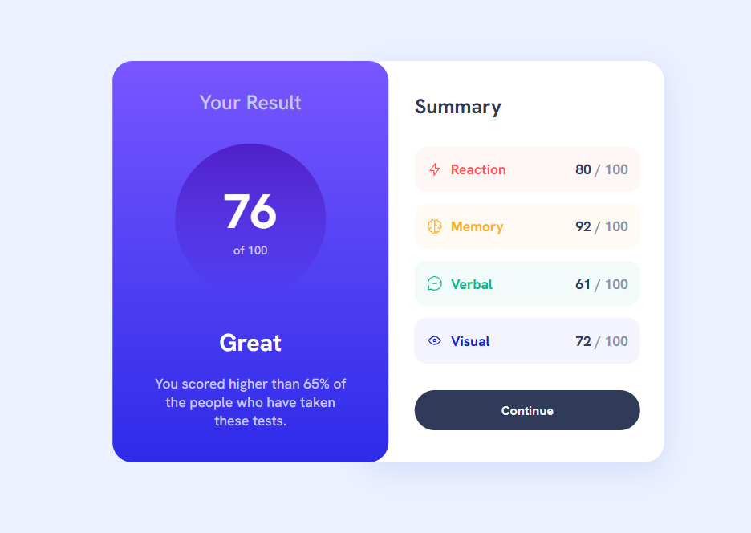

# Frontend Mentor - Results summary component solution

This is a solution to the [Results summary component challenge on Frontend Mentor](https://www.frontendmentor.io/challenges/results-summary-component-CE_K6s0maV). Frontend Mentor challenges help you improve your coding skills by building realistic projects. 

## Table of contents

- [Overview](#overview)
  - [The challenge](#the-challenge)
  - [Screenshot](#screenshot)
  - [Links](#links)
- [My process](#my-process)
  - [Built with](#built-with)
  - [What I learned](#what-i-learned)
- [Author](#author)

## Overview

### The challenge

Users should be able to:

- View the optimal layout for the interface depending on their device's screen size
- See hover and focus states for all interactive elements on the page
- Dynamically populate the content from a JSON file.

### Screenshot



### Links

- Solution URL: [My solution](https://www.frontendmentor.io/solutions/responsive-results-summary-component-3q32PNzH64)
- Live Site URL: [Live demo](https://mohamed-devp.github.io/results-summary-component/)

## My process

### Built with

- Semantic HTML5 markup
- CSS custom properties
- Flexbox
- Mobile-first workflow

### What I learned

While styling my website i learned this aweasome css trick that allowed me to add a smooth backgound gradient transition effect to an element using the ```::after``` selector.

```css
button::after {
    content: '';
    position: absolute;
    left: 0; right: 0;
    top: 0; bottom: 0;
    background: linear-gradient(var(--slate-blue), var(--royal-blue));
    opacity: 0;
    transition: opacity 0.25s ease-in;
    pointer-events: none;
}
```

## Author

- Frontend Mentor - [@Mohamed-Devp](https://www.frontendmentor.io/profile/Mohamed-Devp)